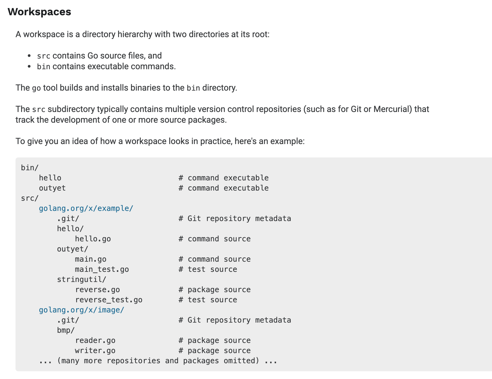
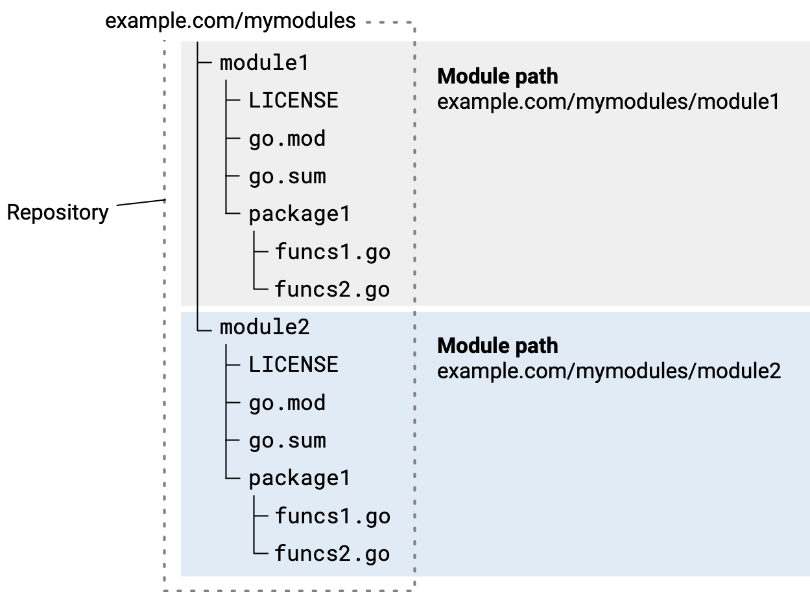

#### History
```
https://golang.org/doc/faq#Origins
```

#### Go Tools

```
$ go
Go is a tool for managing Go source code.

Usage:

	go <command> [arguments]

The commands are:

	bug         start a bug report
	build       compile packages and dependencies
	clean       remove object files and cached files
	doc         show documentation for package or symbol
	env         print Go environment information
	fix         update packages to use new APIs
	fmt         gofmt (reformat) package sources
	generate    generate Go files by processing source
	get         add dependencies to current module and install them
	install     compile and install packages and dependencies
	list        list packages or modules
	mod         module maintenance
	run         compile and run Go program
	test        test packages
	tool        run specified go tool
	version     print Go version
	vet         report likely mistakes in packages

Use "go help <command>" for more information about a command.

Additional help topics:

	buildconstraint build constraints
	buildmode       build modes
	c               calling between Go and C
	cache           build and test caching
	environment     environment variables
	filetype        file types
	go.mod          the go.mod file
	gopath          GOPATH environment variable
	gopath-get      legacy GOPATH go get
	goproxy         module proxy protocol
	importpath      import path syntax
	modules         modules, module versions, and more
	module-get      module-aware go get
	module-auth     module authentication using go.sum
	packages        package lists and patterns
	private         configuration for downloading non-public code
	testflag        testing flags
	testfunc        testing functions
	vcs             controlling version control with GOVCS

Use "go help <topic>" for more information about that topic.
```
### Create a Go module

1. Create a greetings directory for your Go module source code.
1. Start your module using the go mod init command

```
go mod init example.com/greetings
```
3. put your main.go and run

### Call your code from another module

```
<home>/
 |-- greetings/
 |-- hello/
```


## Workspace


### Organizing code in the repository
You can keep maintenance simple and improve developers' experience with your module by following the conventions described here. Getting your module code into a repository is generally as simple as with other code.


```
git init
git add --all
git commit -m "mycode: initial commit"
git push
```

#### Sourcing multiple modules in a single repository

You can publish multiple modules from a single repository. For example, you might have code in a single repository that constitutes multiple modules, but want to version those modules separately.

For example, for module example.com/mymodules/module1 below, you would have the following for version v1.2.3:

* Module path: example.com/mymodules/module1
* Version tag: module1/v1.2.3
* Package path imported by a user: example.com/mymodules/module1/package1
* Module path as given in a user’s require directive: example.com/mymodules/module1 module1/v1.2.3



